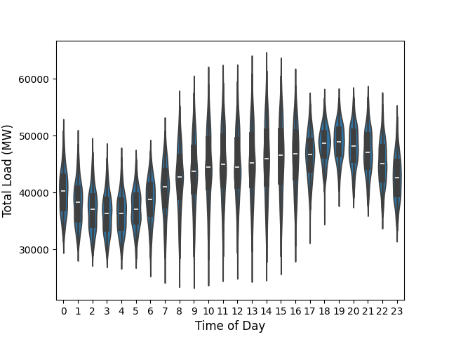

# ⚡ Energy Load Forecasting: Accuracy vs. Computational Cost Trade-off

> **TL;DR (Business Conclusion):** This project evaluates the trade-off between accuracy and computational cost for short-term energy load forecasting in Southeast Brazil. **Result:** **XGBoost** delivers the best ROI for production environments, achieving a **3.12% MAPE** while reducing training time by **~99.9%** (from 781s to 0.14s) compared to SARIMAX, proving that complex Deep Learning (LSTM) is not always necessary for optimal real-time forecasting.

---

## 📊 Key Results & Trade-off Analysis

The core of this project is not just predicting the load, but evaluating **which model is viable for real-world deployment**. Below is the comparison of the best-performing models:

| Model | Paradigm | MAPE (Accuracy) | Training Time | Inference Time | Hardware Bottleneck |
| :--- | :--- | :---: | :---: | :---: | :--- |
| **XGBoost (CPU)** | Machine Learning | **3.12%** ✅ | **0.14s** ✅ | **0.006s** ✅ | None (Highly Efficient) |
| **LSTM** | Deep Learning | 3.63% | 16.98s | 0.18s | CPU/GPU overhead |
| **SARIMAX** | Statistical | 5.33% | 781.82s ❌ | 0.51s | Severe convergence issues |
| **Linear Regression**| Statistical (Base)| 6.21% | 0.01s | 0.0003s | Fails to capture seasonality |

*💡 **Takeaway:** XGBoost provides state-of-the-art accuracy with a fraction of the computational cost, making it the ideal candidate for systems requiring frequent retraining or real-time inference.*

---

## 💡 Business Context

Accurate short-term (hour-ahead) energy load forecasting is critical for:
1. **Preventing Blackouts:** Avoiding under-estimation of demand that overloads power lines.
2. **Cost Optimization:** Avoiding over-estimation, which leads to unnecessary energy conversion and wasted resources.
3. **Sustainability:** Aligning with UN SDGs 7 (Affordable Energy) and 13 (Climate Action) by optimizing grid efficiency.

---

## 🛠️ Tech Stack & Environment

- **Languages & Core:** Python 3.13, Pandas, NumPy, Scikit-learn
- **Modeling:** XGBoost, TensorFlow/Keras (LSTM), Statsmodels (SARIMAX/LR)
- **Interpretability:** SHAP (SHapley Additive exPlanations), Feature Importance
- **Deployment/Reproducibility:** Docker, Docker Compose, Jupyter Lab
- **Hardware Tested:** Intel i5-14400F, 32GB DDR4 RAM, NVIDIA RTX 5060

---

## 🔍 Methodology Highlights

- **Real-World Data:** Integrated hourly data (2023-2024) from **ONS** (National Electric System Operator) and **INMET** (National Institute of Meteorology) for 15 stations in the Southeast region.
- **Advanced Feature Engineering:** Created lag features (1h to 48h), calculated Perceived Temperature (Wind Chill / Heat Index), and encoded meteorological seasons.
- **Robust Validation:** Used `TimeSeriesSplit` to strictly prevent data leakage, a common pitfall in time-series forecasting.
- **Explainable AI (XAI):** Went beyond the "black box". Used **SHAP values** for LSTM and native Feature Importance for XGBoost to ensure model predictions are auditable and aligned with business logic.

---

## 📈 Visual Insights

*(Note to Recruiter/Manager: The graphs below demonstrate the data patterns, rigorous feature selection, and model interpretability)*

*Figure 1: Hourly load demand distribution, revealing clear peak patterns (around 6-7 PM) and distinct behavioral differences between weekdays and weekends.*

*Figure 2: Correlation matrix heatmap after removing multicollinear features (like redundant lag hours), ensuring a robust and non-redundant feature set for the models.*

---

## 🚀 How to Run

The project is fully containerized for reproducibility. 

## Option 1: Docker Compose (Recommended)
### 1. Clone the repository

git clone https://github.com/SiddiJr/energy-load-forecast.git
cd energy-load-forecast

### 2. Build and start the container in the background

docker-compose up -d

### 3. Access Jupyter Lab in your browser
http://localhost:8888

## Option 2: Manual Installation

If you prefer to run the project locally without Docker, follow these steps:

### 1. Clone the repository
git clone https://github.com/SiddiJr/energy-load-forecast.git
cd energy-load-forecast

### 2. Install dependencies (Recommended: use a virtual environment)
pip install -r requirements.txt

### 3. Launch Jupyter Lab
jupyter lab

## 📚 References & Author

This project is the practical implementation of the research paper:  
**"Trade-Off Analysis of Statistical and Machine Learning Models in Energy Load Forecasting for the Brazilian Southeast Region: Accuracy vs Computing Cost vs Interpretability"**  
*Published under the Creative Commons Attribution 4.0 International License (CC BY 4.0).*

**Author:** Sidnei José de Castro Ribeiro Junior  
🔗 [LinkedIn](https://www.linkedin.com/in/sidjr/) | ✉️ [sidnei.castro.jr@outlook.com](mailto:sidnei.castro.jr@outlook.com)  

**Advisor:** Adolfo Neto (UTFPR)
🔗 [LinkedIn](https://www.linkedin.com/in/adolfont/) | ✉️ [adolfo@utfpr.edu.br](mailto:adolfo@utfpr.edu.br)  
